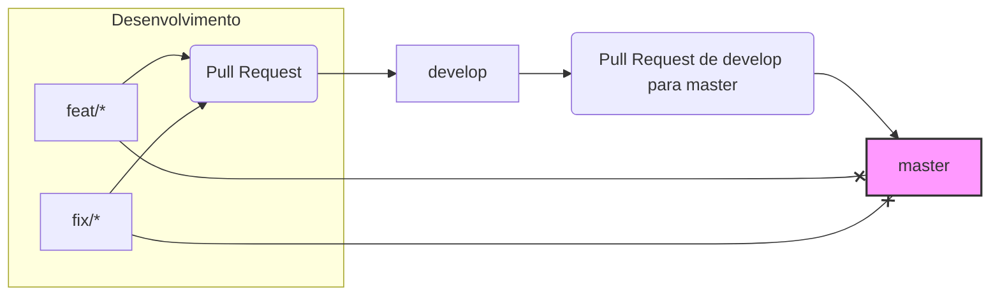

# ms-demo-deploy

Este repositório tem como objetivo demonstrar um fluxo de versionamento de código e deploy para microserviços, utilizando as funcionalidades de proteção de branches do GitHub para garantir a qualidade e rastreabilidade das mudanças.

## Objetivo

O foco principal deste repositório e do material associado é ilustrar a configuração e a aplicação das regras de proteção nas branches `develop` e `master` no GitHub, visando estabelecer um fluxo de trabalho rigoroso para o versionamento e deploy de microserviços, alinhado a processos de Gerência de Mudanças (GMUD):

1.  **Branch Padrão e Desenvolvimento (develop):** A branch `develop` é configurada como a branch padrão (default branch) deste repositório. Ela representa o estado **estável** mais recente do código e serve como base para o desenvolvimento contínuo. Novas funcionalidades, correções de bugs e outras melhorias são desenvolvidas em branches dedicadas (`feat/*`, `fix/*`, `chore/*`, etc.).

2.  **Integração na Branch `develop` após Aprovação de GMUD:** As mudanças desenvolvidas nas branches de feature, correção, etc. (`feat/*`, `fix/*`, `chore/*`) só devem iniciar seu processo de integração na branch `develop` **após a aprovação da respectiva Gerência de Mudanças (GMUD)** que autoriza a execução daquela mudança. A integração ocorre **exclusivamente** através de **Pull Requests (PRs)** direcionados à `develop`. Para garantir a qualidade técnica e a conformidade com as práticas de DevOps, cada PR exige:
    * A **inclusão obrigatória do time de DevOps como revisores** (preferencialmente via configuração de *Code Owners* no GitHub).
    * A **adição de outros revisores** pertinentes pela pessoa desenvolvedora responsável pelo PR.
    * A **aprovação de pelo menos 2 revisores** (incluindo, implicitamente, a aprovação do time de DevOps se configurado como obrigatório via *Code Owners* ou revisor mandatório).

3.  **Deploy em Sandbox/Homologação:** Uma vez que as mudanças são integradas na branch `develop` (após a aprovação da GMUD e o merge do PR), o processo de Continuous Deployment (CD) – tipicamente orquestrado por ferramentas como o ArgoCD – monitora esta branch e dispara automaticamente o deploy da nova versão do microserviço em um ambiente de **Sandbox ou Homologação** para validação.

4.  **Promoção para a Branch `master` (Produção) via PR e GMUD:** A branch `master` representa o estado do código **publicado em Produção**. A promoção de uma versão validada em Homologação para Produção ocorre **exclusivamente** através de um **Pull Request de `develop` para `master`**. Este PR serve como o gate final antes da implantação em produção e também deve estar associado a uma **GMUD aprovada** que autorize a implantação em Produção. As regras de proteção para esta branch são as mais rigorosas:
    * Apenas Pull Requests vindos da branch `develop` são permitidos.
    * Revisões são requeridas para o merge (mesmo sendo um PR de `develop`).
    * É configurada uma regra de proteção que **impede** que qualquer outra branch (`feat/*`, `fix/*`, etc.) crie PRs ou faça commits diretos na branch `master`, reforçando que o único caminho é via `develop`.
    * O ArgoCD monitorará a branch `master` para realizar o deploy automático em Produção uma vez que o PR de `develop` para `master` seja aprovado e mergeado.

Este fluxo estabelece um controle robusto sobre as mudanças, garantindo que cada alteração passe por aprovação formal (GMUD), revisão procedural (DevOps e outros revisores) e validação por ambientes inferiores antes de ser promovida para a produção, refletida na branch `master`.
## Fluxo Visual Simplificado

*Note: O diagrama acima é uma representação simplificada. A exigência de 2 aprovações no PR para `develop` e as restrições diretas para `master` são garantidas pelas regras de proteção do GitHub.*

